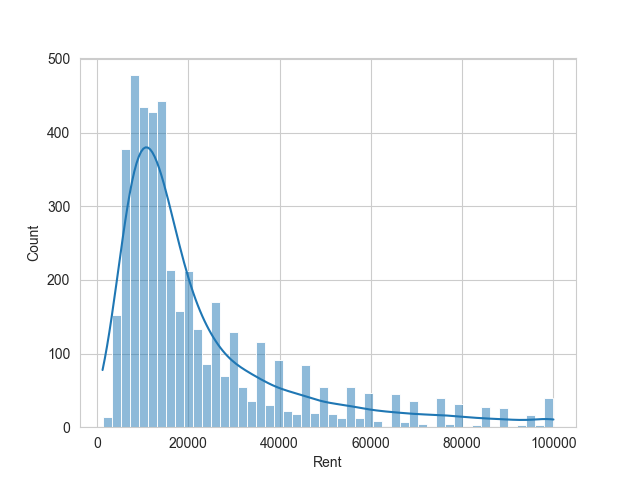
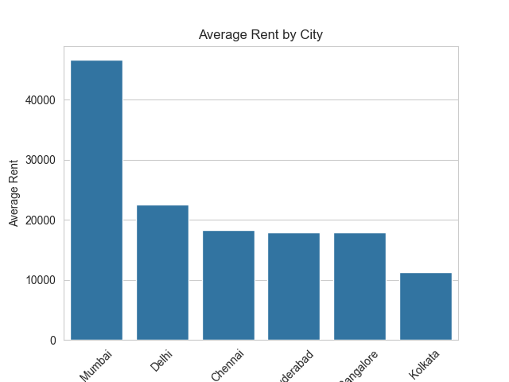
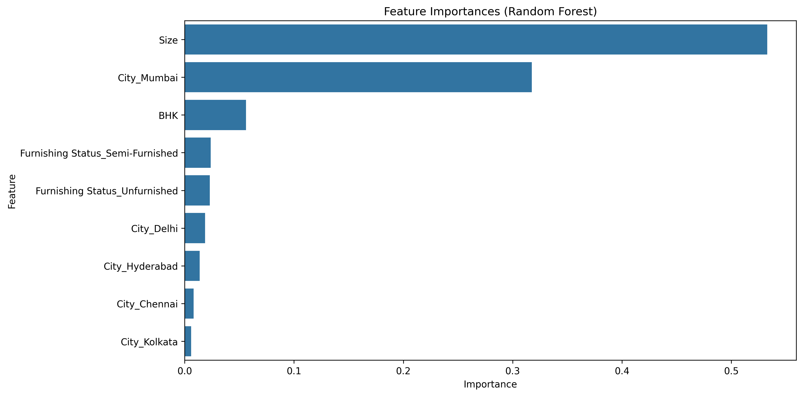
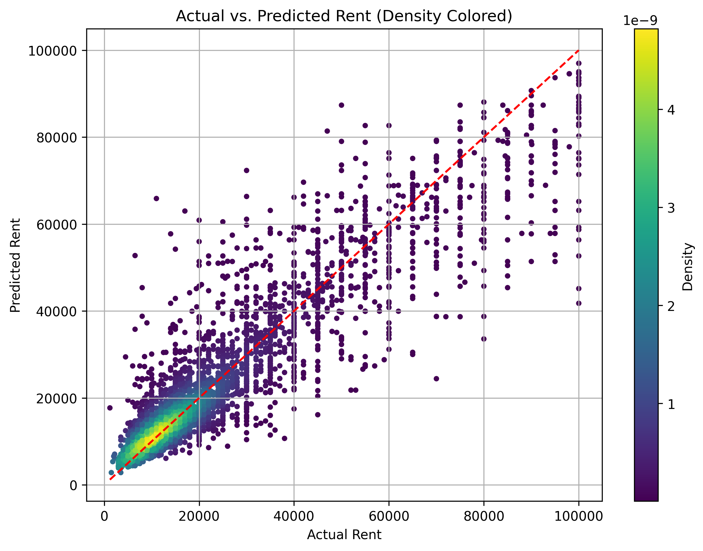

# 🏠 Smart Rent Advisor

Smart Rent Advisor is a machine learning project that predicts house rent prices based on various features like size, location, furnishing status, and more. Designed for renters, real estate analysts, and property platforms, it leverages a Random Forest model trained on real-world data.

---

# 📊 Project Objective
To build a predictive model that accurately estimates house rent based on user-defined features, helping:<br>

Users find affordable housing.<br>

Property owners price their listings.<br>

Real estate platforms provide rent insights.<br>

---

# 🎓 Key Features
🎯 Random Forest-based rent prediction <br>

🎯 Cleaned & preprocessed housing dataset <br>

🎯 Feature importance insights <br>

🎯 Visualizations: Feature importances, actual vs. predicted rents <br>

🎯 Modular pipeline (EDA, preprocessing, training, dashboard) <br>

---


## 🗂️ Project Structure
```
smart-rent-advisor/
├── app.py              # 🔹 Streamlit dashboard
├── data/
│ ├── raw/              # 📂 Cleaned & raw datasets
│ └── processed/              # 📂 (Optional) Transformed sets
├── models/              # 📁 Trained models and scalers
│ ├── random_forest_model.pkl
│ └── scaler.pkl
├── notebooks/              # 📒 Jupyter Notebooks (EDA, modeling)
├── plots/              # 📊 Visualizations
├── src/
│ ├── data_cleaning.py              # 🔧 Cleaning logic
│ ├── utils.py              # 🧠 Preprocessing functions
│ └── train_model.py              # 🏋️ Model training script
└── README.md              # 🧾 Project overview
└── README_DEV.md              # 🧾 For Developers
```

---

# 📈 Visualizations












---

# ⚙️ Tech Stack

    ♦️ Python 3.11+

    ♦️ Pandas, Scikit-learn, Matplotlib, Seaborn

    ♦️ Streamlit (for dashboard)

    ♦️ Joblib (for model serialization)

---

## 🚀 Quick Start

### ✅ 1. Create & Activate Virtual Environment

```bash
# Create venv
python -m venv venv

# Activate
.\venv\Scripts\activate      # Windows
# or
source venv/bin/activate     # macOS/Linux
```

### ✅ 2. Install Dependencies

```bash
pip install -r requirements.txt
```

If you don't have one, generate with:

```bash
pip freeze > requirements.txt
```

### ✅ 4. Train the Model

```bash
python src/train_model.py
```
Outputs:

Model: models/random_forest_model.pkl

Scaler: models/scaler.pkl

### ✅ 5. Launch the Streamlit App

```bash
streamlit run app.py
```

---

# 📊 Sample Results
    ⌛ MAE: ~6,800 INR

    ⌛ R² Score: ~0.70

    ⌛ Most important features: Size, City_Mumbai, BHK


---

👨‍💻 Author <br>
Yash Kr. Shaw

---